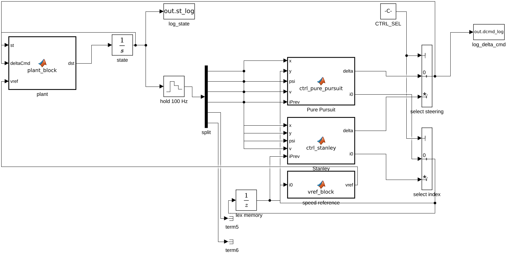
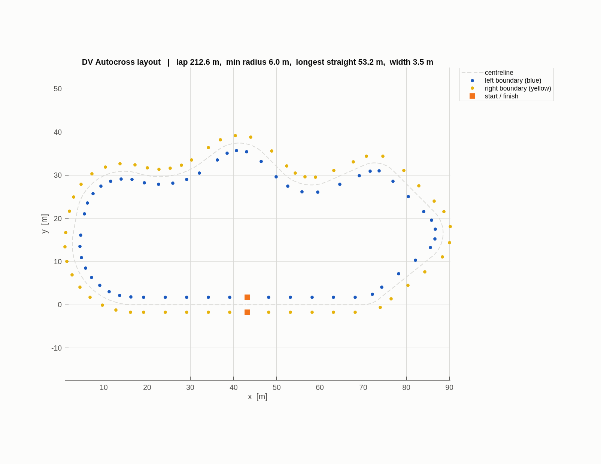
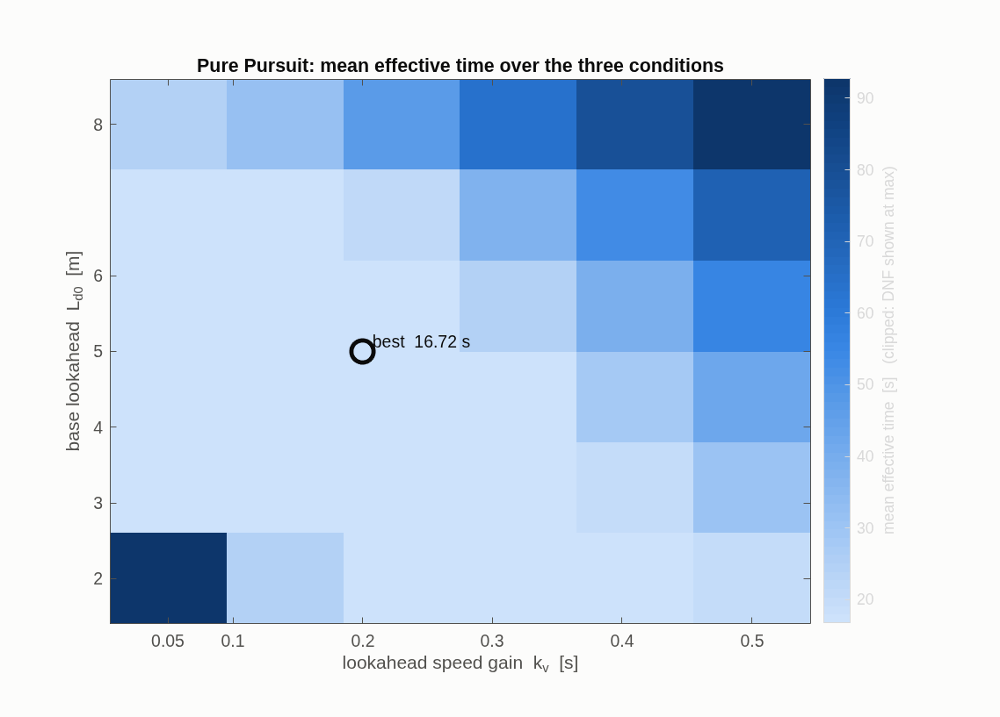
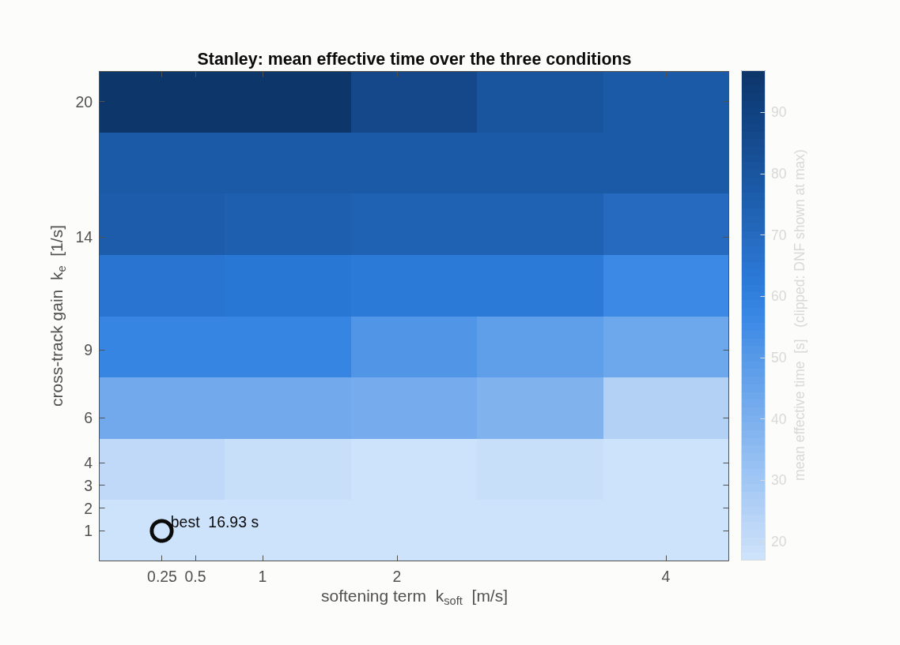
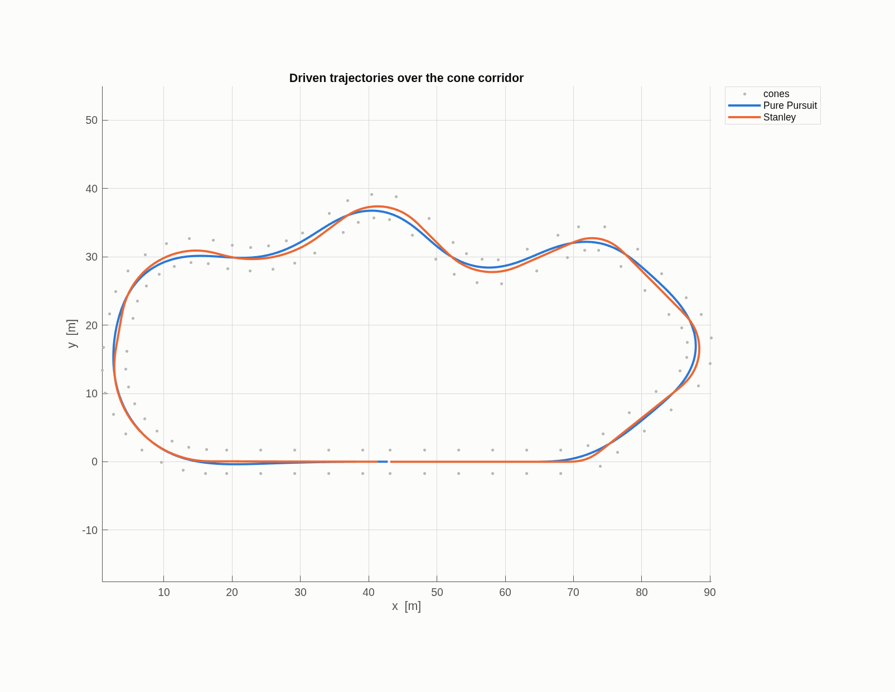
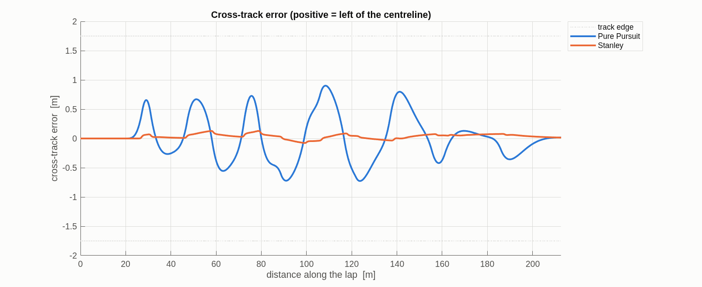
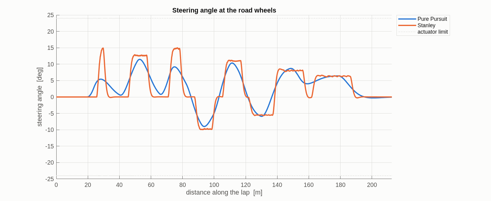
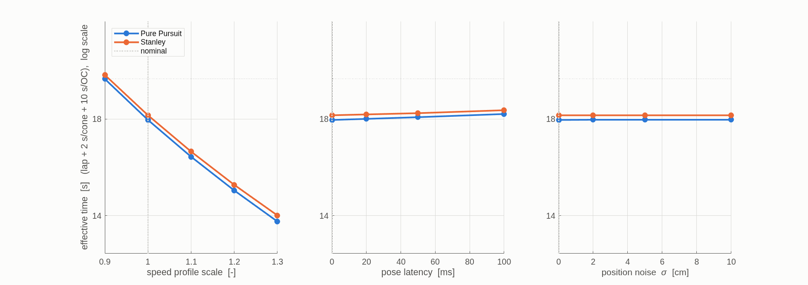
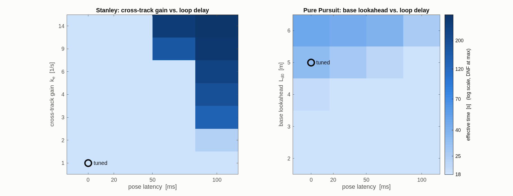
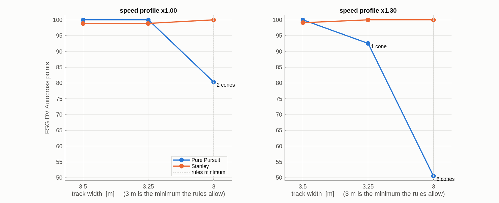

# Pure Pursuit vs. Stanley for DV Autocross

A comparison of the two classical lateral controllers on a cone-delimited
Formula Student Driverless Autocross layout, in Simulink, decided on five KPIs
and the competition's own scoring formula.

---

## 1. What was built, and why this way

The deliverable is one Simulink model, `autox_lateral.slx`, in which **only the
steering law changes**. The track, the speed reference, the longitudinal
controller, the steering actuator, the vehicle model, the control rate and the
solver are identical for both controllers. Any difference in the results is
therefore attributable to the steering law, which is the only claim a controller
comparison can honestly make.



| Element | Implementation |
|---|---|
| state | one six-element `Integrator`: `x, y, psi, v, delta, eInt` |
| plant | `plant_block` → `vehicle_ode.m`, the continuous derivative |
| controllers | two MATLAB Function blocks loading `ctrl_pure_pursuit.m` and `ctrl_stanley.m` |
| control rate | 100 Hz, via a zero-order hold on the state vector |
| selection | zero-based `Multiport Switch` on `CTRL_SEL` (0 = pure pursuit, 1 = Stanley) |
| index state | `Unit Delay` carrying the centreline index between control steps |
| solver | fixed-step `ode4` at 1 ms |

Both controllers are evaluated every step and one is selected, so a single run
also records what the other law would have commanded at every instant.

**No toolboxes beyond MATLAB and Simulink are used.** The two library blocks
that would have been the obvious shortcut were rejected deliberately:

- `robotalgslib/Pure Pursuit` (Navigation Toolbox) takes a pose and a waypoint
  array and returns *linear and angular velocity*, not a steering angle. Driving
  a bicycle-model car with it requires an added `delta = atan(omega*L/v)`
  conversion layer on top of a block whose interior cannot be inspected.
- `drivingvehiclecontroller/Lateral Controller Stanley` (Automated Driving
  Toolbox) is not the textbook law: it carries its own position-gain and
  yaw-rate terms and its own input convention. Comparing it against the
  Navigation Toolbox pure pursuit block would compare two blocks with different
  internal assumptions, which quietly destroys the fairness of the comparison.
- Both require the reference path as distance-indexed lookup tables or waypoint
  arrays, and both then need heading-unwrapping pre-processing. On a closed loop
  the heading passes through ±180° several times per lap, and that
  pre-processing - not the control law - is where the defects would come from.

Writing the two laws directly costs ten lines of trigonometry and buys the
ability to prove them correct (§4) and to state them in this report.

---

## 2. The track

`src/track_autox.m` builds the centreline as a **closed polygon with circular
fillets** at its vertices. Closure is then exact because the polygon closes,
straights are exactly straight, each corner radius is an explicit design input,
and heading and curvature are analytic (`kappa = 0` on a straight, `±1/R` on an
arc) rather than finite-differenced.



The layout follows the guidelines the rules give for the DV Autocross
(**D 6.1.3**, which refers the DV layout to **D 8.1**):

| property | measured | rule |
|---|---|---|
| lap length | 212.6 m | D 8.1.2: approximately 200-500 m |
| minimum turning diameter | 12.00 m | D 8.1.1: >= 9 m |
| longest straight | 53.2 m | D 8.1.1: <= 80 m |
| track width | 3.50 m | D 8.1.1: >= 3 m |
| total turn | 360.0000 deg | closed loop |
| closure error | 2.3·10⁻⁴ m | closed loop |

The closure figure is worth a line: because the centreline is a filleted polygon
rather than a fitted curve, the loop closes to a quarter of a millimetre with no
correction applied. A lap time measured on a track that does not close is not a
lap time.

Four features were placed deliberately, because they are where the two laws
diverge:

| Feature | What it exposes |
|---|---|
| long straight into a tight hairpin | pure pursuit cutting the corner |
| slalom of alternating short-radius corners | Stanley's steering activity |
| decreasing-radius corner | the limits of a fixed lookahead |
| fast open sweep | baseline, both should be clean |

Cones sit on both boundaries at the rule colours - blue on the left of the
direction of travel, yellow on the right, orange for the start/finish gate -
5 m apart on open sections and 3 m apart in corners.

---

## 3. Vehicle, actuator and speed reference

The vehicle is a kinematic bicycle referenced to the rear axle:

```
xdot = v*cos(psi)      psidot = v*tan(delta)/L
ydot = v*sin(psi)      vdot   = a
```

**Pure pursuit is derived at the rear axle and Stanley at the front axle**, so
the front axle position is formed explicitly for Stanley,
`(x + L*cos(psi), y + L*sin(psi))`. Feeding both laws from the same point is the
most common way to produce an unfair comparison, and `tests/run_tests.m`
contains a check that fails if the front-axle reference is dropped.

The steering actuator is a rate-limited first-order lag,

```
ddelta/dt = sat( (sat(deltaCmd, dMax) - delta)/tauSteer , dRateMax )
```

written as a single ODE rather than as a `Rate Limiter` in series with a
transfer function. Two reasons: without an actuator, pure pursuit is handed an
unphysical advantage (infinitely fast steering), and in this form RK4 and `ode4`
integrate the identical equation, which is what makes the agreement in §5
meaningful.

The speed reference is a function of arc length only - grip limit
`v <= sqrt(aLatMax/|kappa|)`, then braking and acceleration passes that **wrap
around the start/finish line** - and is therefore identical for both
controllers. A non-wrapping pass would leave an artificial speed notch at `s = 0`
and a fake braking event in both lap times.

Parameters are engineering assumptions for a representative FS driverless car:
wheelbase 1.55 m, steering ±24° at up to 120°/s with a 0.05 s lag, lateral
acceleration limit 11.8 m/s² (≈1.2 g on slicks), 5 m/s² acceleration, 8 m/s²
braking, 15 m/s speed cap, body 2.90 × 1.20 m for cone contact.

---

## 4. Correctness of the two laws

The controllers are checked against closed-form results, not against another
implementation. `tests/run_tests.m` runs 21 checks; the ones that carry the
argument:

| Check | Why it is conclusive |
|---|---|
| **Ackermann on a circle** | With the rear axle on a circle of radius `R` and zero cross-track error, the goal point at lookahead `Ld` subtends `sin(alpha) = Ld/(2R)`, so `atan(2*L*sin(alpha)/Ld)` must return exactly `atan(L/R)` for **any** `Ld`. Verified at R = 8, 15, 30, 60 m to within 4·10⁻⁵ rad. |
| **zero error ⇒ zero steering** | On the path with zero heading error both laws must return exactly 0. Catches offset and sign slips. |
| **mirror symmetry** | Mirroring the track in `y` must negate every lateral signal and leave the KPIs bit-identical. This is the check that catches a wrong sign in the cross-track error, the left normal, or the Stanley feedback term - a defect that survives any single-direction test. |
| **step response** | Released 1 m off a straight, both must converge below 1 cm without overshooting past the starting offset. |
| **index continuity** | The windowed nearest-point search must not jump across the loop at a hairpin. |

The Ackermann check earned its place immediately: it failed at R = 8 m on the
first run and exposed a real defect. The goal point was being marched `Ld` along
the **arc length**, whereas pure pursuit's `Ld` is the straight-line **chord**
from the vehicle. Since arc > chord on any curve, the goal point sat too close
and the commanded angle was biased low in tight corners - by 0.29° at R = 8 m,
growing as the radius shrank. Finding the goal point on the chord fixed it and
made the check exact.

---

## 5. Does the Simulink model do what the code says?

`verify_equivalence.m` runs `run_reference.m` - the same controller and plant
files integrated with RK4 in plain MATLAB - and the Simulink model at the same
fixed step, then measures the difference over a full lap:

| Deviation over one lap | Pure Pursuit | Stanley | tolerance |
|---|---|---|---|
| position | 4.45·10⁻¹¹ m | 4.45·10⁻¹¹ m | 10⁻³ m |
| heading | 3.05·10⁻¹² rad | 3.26·10⁻¹² rad | 10⁻⁴ rad |
| speed | 8.03·10⁻¹² m/s | 7.40·10⁻¹² m/s | 10⁻³ m/s |
| steering | 4.99·10⁻¹³ rad | 2.80·10⁻¹² rad | 10⁻⁴ rad |

Agreement at machine precision - eight orders of magnitude inside the
tolerances, so the tolerances are not doing any work. The check runs at the
default gains of `params_vehicle.m`, not the tuned ones, so it tests the model
rather than a particular operating point. The MATLAB reference loop
also runs unmodified in GNU Octave, which is how the numbers in this report were
produced before MATLAB was available.

---

## 6. KPIs and the decision rule

### 6.1 Tuning, and why the choice of conditions is itself a result

Each law's two gains were chosen by grid search against the **same** objective:
the mean effective competition time over five conditions - nominal, +15 % and
+30 % speed, and 20 ms and 100 ms of pose latency.

| controller | gains | objective J | grid |
|---|---|---|---|
| Pure Pursuit | `Ld0` = 5.0 m, `kv` = 0.20 s | 16.720 s | 6 × 6 |
| Stanley | `ke` = 1.0 1/s, `ksoft` = 0.25 m/s | 16.932 s | 8 × 5 |




The set of conditions changed the conclusion of this study, so it is worth
stating plainly. An earlier objective used only nominal, +15 % speed and 20 ms
latency - an envelope inside which neither law is anywhere near its stability
limit. The search therefore rewarded the fastest gains rather than the safest
and returned `ke` = 14 for Stanley and `Ld0` = 4 for pure pursuit. Both are
fragile just outside that envelope: Stanley at `ke` = 14 loses the car at 50 ms
of delay (279 s effective time, 32 cones), and pure pursuit at `Ld0` = 4 starts
knocking cones above +20 % speed. Adding the two severe conditions costs the
optimum about 0.05 s of nominal lap time and removes both failures. The earlier
result is kept in `results_tuning_3cond.mat` as the counter-example.

**Gain-space usability** - the fraction of the swept grid landing within x % of
that law's own best - is reported because a team that mistunes between runs pays
for it in points:

| controller | grid pairs | within 1 % | within 5 % | best | worst |
|---|---|---|---|---|---|
| Pure Pursuit | 36 | 19.4 % | 44.4 % | 16.72 s | 213.4 s |
| Stanley | 40 | 12.5 % | 15.0 % | 16.93 s | 96.9 s |

Neither law has a broad plateau once 100 ms of delay must be tolerated. This is
a point **for pure pursuit**: rather more of its gain space clears the bar.

### 6.2 The five KPIs on the nominal lap





| KPI | Pure Pursuit | Stanley | better |
|---|---|---|---|
| 1. lap time | **17.960 s** | 18.180 s | PP by 0.22 s |
| 2. max cross-track error | 0.902 m | **0.129 m** | Stanley by 7.0× |
| 3. RMS cross-track error | 0.408 m | **0.055 m** | Stanley by 7.4× |
| 4. RMS steering rate | **8.73 °/s** | 21.12 °/s | PP by 2.4× |
| 5. cones Down or Out | 0 | 0 | tie |
| effective time (D 10.1.7) | **17.960 s** | 18.180 s | PP |
| FSG DV points (D 9.3.2) | **100.00** | 98.87 | PP by 1.13 |

The cross-track trace shows the mechanism: pure pursuit rounds every corner,
building an error that peaks near 0.9 m at each apex, and its lookahead makes
that error a smooth, low-frequency shape - hence the low steering activity.
Stanley holds the centreline to within 0.13 m and pays for it with 2.4 times the
steering rate.

**A large cross-track error is not automatically a fault, and lower error is not
a faster lap.** Both points follow from what the error is measured against. The
reference here is the *centreline* - the midpoint between the two cone
boundaries - and the centreline is not the fast way round a track. A racing line
runs wide into a corner and cuts to the apex; it is shorter and faster than the
centreline precisely by deviating from it. So cross-track error measures
fidelity to the reference line, not the quality of the line being driven, and a
controller that holds the centreline perfectly is holding a line that is known
not to be optimal. Measured over a lap:

| | centreline | Pure Pursuit | Stanley |
|---|---|---|---|
| distance driven | 212.64 m | 208.54 m | 210.17 m |
| versus centreline | - | −4.10 m | −2.47 m |
| mean speed | - | 11.611 m/s | 11.561 m/s |

Pure pursuit drives 1.63 m less than Stanley, which at 11.6 m/s is 0.14 s of the
0.22 s gap; the rest is its marginally higher mean speed. Its error is not
costing it time, it *is* the corner-cutting that saves it time.

The mechanism is geometric and it is worth showing rather than asserting. Pure
pursuit steers along a **chord** to a point ahead on the centreline, and a chord
always passes inside the arc, so its path sits inside the centreline through
every corner - further inside the longer the lookahead. Sweeping `Ld0` with
everything else fixed makes the whole chain visible
(`src/sweep_lookahead.m`):

| `Ld0` | distance driven | vs centreline | lap time | max \|e_y\| | cones | effective time |
|---|---|---|---|---|---|---|
| 1.0 m | 212.08 m | −0.56 m | 18.320 s | 0.139 m | 0 | 18.32 s |
| 2.0 m | 211.75 m | −0.89 m | 18.280 s | 0.254 m | 0 | 18.28 s |
| 3.0 m | 210.95 m | −1.69 m | 18.200 s | 0.392 m | 0 | 18.20 s |
| 4.0 m | 209.85 m | −2.79 m | 18.090 s | 0.591 m | 0 | 18.09 s |
| 5.0 m **(tuned)** | 208.54 m | −4.10 m | **17.960 s** | 0.902 m | 0 | 17.96 s |
| 6.0 m | 207.25 m | −5.39 m | 17.830 s | 1.256 m | **2** | **21.83 s** |
| **Stanley** | 210.17 m | −2.47 m | 18.180 s | **0.129 m** | 0 | 18.18 s |

More lookahead, more corner cut, shorter path, faster lap, larger error -
monotonically - until at `Ld0` = 6 m the error has spent the clearance to the
cone line, two cones fall, and 4 s of penalty erases everything the cutting
bought.

The row to read twice is the first one against the last. **Held to Stanley's
tracking accuracy, pure pursuit is the slower of the two**: at `Ld0` = 1 m its
peak error is 0.139 m against Stanley's 0.129 m, and its lap is 18.320 s against
Stanley's 18.180 s. So the nominal lap-time advantage is not the law being
better - it is the law cutting more corner. Stanley is in fact the more
*efficient* line at equal accuracy: it cuts 2.47 m with a 0.129 m peak error,
where pure pursuit needs a 1.256 m peak error to cut 5.39 m, because Stanley's
deviation is one-directional corner lag while pure pursuit's oscillates to both
sides of the line.

The consequence for this report is that **KPIs 2 and 3 are margin metrics here,
not speed metrics** - which is exactly why the verdict in §6.4 turns on clearance
to the cone line rather than on lap time. And it bounds the claim being made:
with the centreline as the reference, lap time mostly measures how far inside it
a controller is willing to run. Against an optimised racing line - where
deviating from the reference costs time instead of saving it - the ranking on
lap time would be expected to invert. That experiment is not in this study; see
§7.

One further quantity, measured but not counted as a KPI, is specific to a
driverless car: the cost of one control step. Pure pursuit costs 1.4-1.8 µs per call against Stanley's
0.9-1.0 µs, because its goal-point search sits on top of the nearest-point
search that both perform. This is a wall-clock benchmark, so the absolute
figures move by tens of percent between runs and only the ratio - about 1.5× -
is stable. Either way it is on the order of 0.01 % of a 10 ms control period:
neither law is near a rate limit, and the point of measuring is to be able to
say so rather than assume it. (Timed on a desktop in interpreted MATLAB; the
ratio and the order of magnitude transfer, the absolute numbers do not.)

On this track pure pursuit is marginally ahead on the metric the rules score.
That 1.13-point lead is the whole case for it, and §6.4 is about whether it
survives.

### 6.3 Robustness: both are solid, once tuned outside the envelope



| stressor | range | Pure Pursuit | Stanley |
|---|---|---|---|
| speed profile | ×0.90 → ×1.30 | 19.98 → 13.79 s, 0 cones | 20.19 → 14.01 s, 0 cones |
| pose latency | 0 → 100 ms | 17.96 → 18.24 s, 0 cones | 18.18 → 18.42 s, 0 cones |
| position noise | 0 → 10 cm | 17.96 → 17.97 s | 18.18 → 18.18 s |

Every condition is completed cleanly by both, and the two curves stay roughly
0.2 s apart throughout: at the tuned gains neither law has a robustness problem
in this envelope. White position noise up to 10 cm is invisible to both, which
is expected - it enters the steering command and averages out through the
actuator lag and the vehicle's own inertia.

That result only holds at these gains, and the maps below show how narrow that
statement is.



Reading the Stanley panel: at 50 ms of delay the boundary sits between `ke` = 4
and `ke` = 6; at 100 ms it sits between `ke` = 1 and `ke` = 2. Delay-intolerance
is therefore a property of the **gain**, not of the law - and the price of
staying on the safe side is 0.05 s of nominal lap time. The pure pursuit panel
is almost entirely light: at `Ld0` ≤ 4 it is unconditionally stable across every
delay tested, and it shows a mild non-monotonicity worth noting - at `Ld0` = 5-6
with a large speed gain, *adding* delay slightly improves the result, because a
pose delay reduces the over-anticipation of an over-long lookahead.

### 6.4 The deciding experiment: the width the rules actually guarantee

Everything above runs on a 3.5 m track. **D 8.1.1 guarantees only 3 m.** Since
pure pursuit's entire advantage is 1.13 points, it is fair to ask whether that
lead is bought with half a metre of track the organisers are not obliged to give.



| width | speed | controller | cones | clearance | points |
|---|---|---|---|---|---|
| 3.50 m | ×1.00 | Pure Pursuit | 0 | +0.25 m | **100.00** |
| 3.50 m | ×1.00 | Stanley | 0 | +1.02 m | 98.87 |
| 3.50 m | ×1.30 | Pure Pursuit | 0 | +0.11 m | **100.00** |
| 3.50 m | ×1.30 | Stanley | 0 | +1.04 m | 99.09 |
| 3.25 m | ×1.00 | Pure Pursuit | 0 | +0.12 m | **100.00** |
| 3.25 m | ×1.00 | Stanley | 0 | +0.90 m | 98.87 |
| 3.25 m | ×1.30 | Pure Pursuit | 1 | −0.02 m | 92.52 |
| 3.25 m | ×1.30 | Stanley | 0 | +0.92 m | **100.00** |
| 3.00 m | ×1.00 | Pure Pursuit | 2 | −0.00 m | 80.29 |
| 3.00 m | ×1.00 | Stanley | 0 | +0.77 m | **100.00** |
| 3.00 m | ×1.30 | Pure Pursuit | 6 | −0.14 m | 50.53 |
| 3.00 m | ×1.30 | Stanley | 0 | +0.79 m | **100.00** |

Clearance is `width/2 − max|ey| − bodyWidth/2`: the gap between the outer edge
of the car and the cone line at the worst point of the lap. It is what a cone
penalty actually depends on, and it is what KPI 2 is a proxy for.

Pure pursuit runs on 0.25 m of clearance at 3.5 m and nominal speed, 0.11 m at
+30 %. Narrow the track by 25 cm and it goes negative; at the rules' minimum it
loses 2 cones at nominal speed and 6 at +30 %, which is 20 and 50 points. Stanley
never drops below 0.77 m and never touches a cone at any width or speed tested.

### 6.5 Verdict: Stanley

**Stanley is the better controller for DV Autocross**, on these grounds:

1. **Its points do not depend on a generous track.** At the width the rules
   guarantee it scores 100 at both speeds; pure pursuit scores 80.29 and 50.53.
   Pure pursuit's 1.13-point advantage exists only at 3.5 m, and no team is told
   the width in advance.
2. **Margin, not just accuracy.** 0.77 m of worst-case clearance against 0.25 m
   is the difference between a controller with room for an unmodelled error -
   SLAM drift, a mis-detected cone, a wet patch - and one running on the edge.
   KPIs 2 and 3 (7× better cross-track error) are what buy that margin.
3. **It gives up almost nothing.** 0.22 s of lap time, and identical robustness
   to speed, latency and noise once its gain is chosen outside the design
   envelope.

**Where pure pursuit is the right answer.** It uses 2.4× less steering activity
(KPI 4), which matters if the steering actuator is thermally or mechanically the
binding constraint. And rather more of its gain space tolerates a 100 ms loop
(19.4 % against 12.5 % within 1 %), so if the perception-to-actuation delay
cannot be characterised, pure pursuit is the safer thing to hand to a team that
must tune at the event. If the track is known to be wide, it is also marginally
faster.

**One number, if only one is wanted:** FSG DV Autocross points at the rules'
minimum 3 m width and +30 % speed - **Stanley 100.00, pure pursuit 50.53.**

---

## 7. Limitations

Stated plainly, because they bound what the verdict above can claim:

1. **Kinematic vehicle model.** No tyre slip, so understeer at the grip limit
   does not appear. The speed profile caps lateral acceleration at
   `aLatMax` instead of letting the tyres saturate. A 2-DOF dynamic bicycle
   model plugs into the same `vehicle_ode` interface and is the obvious next
   step; the ranking here should be re-checked against it.
2. **Perfect state estimate apart from the injected noise and latency.** No
   SLAM drift, no cone-detection error, no map that has to be built during the
   first lap. In a real DV Autocross run the first lap is driven on perception
   alone.
3. **The reference is the centreline, not a racing line.** This is what makes
   the lateral comparison clean - both laws chase the same line at the same
   commanded speed - but it also means lap time largely measures how far inside
   that line each law runs (§6.2). A minimum-curvature line optimised inside the
   cone corridor would reverse the incentive: deviating from an already-fast
   reference costs time, so tracking accuracy would convert into lap time and
   Stanley would be expected to lead on speed as well. Testing that is the
   single most valuable extension to this study.
4. **One layout.** The features were chosen to separate the two laws, but a
   different Autocross track - tighter, or faster - may shift the balance. The
   track generator is parametric, so this is cheap to re-run.
5. **Gains tuned on this track.** The sweep optimises for this layout and these
   three conditions. It says which law is easier to tune, not what the gains
   should be at a different event.
6. **Longitudinal control is shared and simple.** A PI on a fixed speed
   profile, not a combined-slip optimal controller. This is deliberate - it
   isolates the lateral comparison - but it means neither controller is being
   pushed to the true limit of the car.

---

## 8. Reproducing this

```matlab
run_tests            % 21 analytical checks
run_all              % tune, run, sweep, plot, tabulate
build_model('open',true)
verify_equivalence   % model vs. reference loop
```

Every number and figure in this report is produced by `run_all.m`; the tables in
§2 and §6 are generated into `report/kpi_tables.md` by the same run, so the
prose cannot drift from the code.
